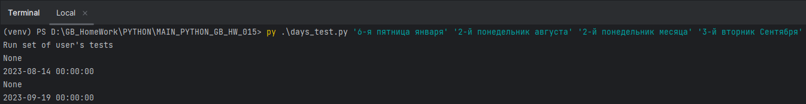
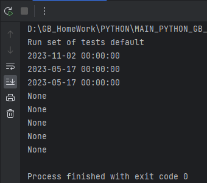
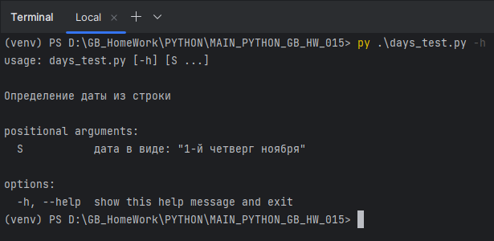
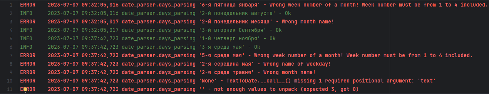
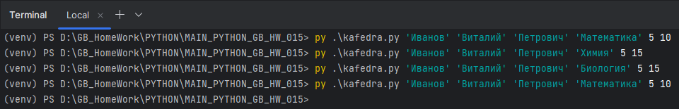
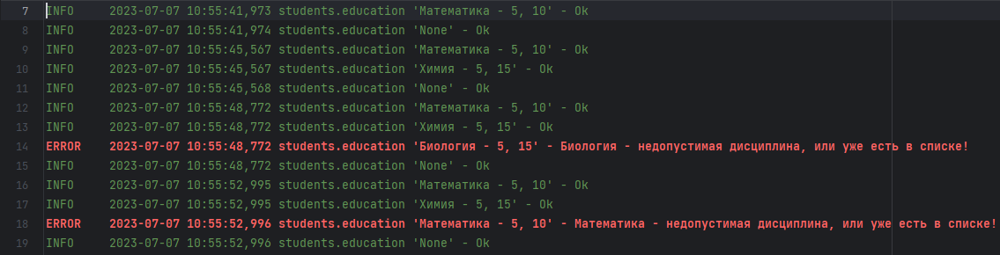
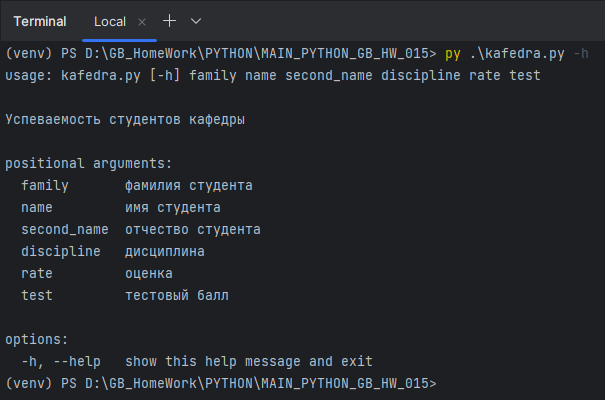

# Погружение в Python. Обзор стандартной библиотеки Python

Возьмите любые 1-3 задачи из прошлых домашних заданий. 
Добавьте к ним логирование ошибок и полезной информации. 
Также реализуйте возможность запуска из командной строки с передачей параметров.

Логирование реализуется через класс-декоратор, записывающий состояние операции, 
время выполнения, переданные параметры и результат работы логируемого метода. 

## Задача 1

Доработка задачи с датами с семинара 15. 
Функция получает на вход текст вида:

+ “1-й четверг ноября”
+ “3-я среда мая” и т.п.

Преобразуйте его в дату в текущем году. Логируйте ошибки, если текст не соответствует формату.

Работа парсера настроена на выполнение задач из командной строки, но если данные для работы
пользователем не переданы - будет выполнен разбор тестовых данных, заданный по умолчанию.

**Примеры выполнения**

Вызов из командной строки

Работа без передачи параметров

Пример вывода справки 

Пример лога

## Задача 2

Задача о студентах (12 семинар). Логирование операции добавления дисциплин и сохранения данных в файл. 
Для логирования используется декоратор. Работа производиться ч/з командную строку. 

**Пример выполнения**

Вызов программы

Лог файл

Справка 

